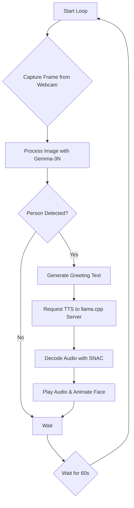

# StandbyMeAI

[](https://www.kaggle.com/competitions/google-gemma-3n-hackathon/overview)

StandbyMeAI is an interactive AI assistant project developed for a Kaggle competition. It leverages multimodal models to understand visual information from a webcam, generate contextual responses, and communicate using Text-to-Speech (TTS) with a symbolic face animation.

## System Architecture

The application operates in a continuous loop with the following workflow:



## Features

*   **Visual Recognition**: Identifies a specific person from a webcam feed using `Gemma-3N`.
*   **Contextual Greeting**: Generates personalized greetings upon successful recognition.
*   **High-Quality TTS**: Converts text into natural-sounding speech using GGUF models served by `llama.cpp`.
*   **Multilingual Ready**: Easily switch between Japanese and English TTS by changing the model and prompt.
*   **Animated Interface**: Displays a simple, symbolic face that animates while scanning and speaking.

## Hardware Requirements

*   PC with 32GB or more of main memory. (GPU recommended for `llama.cpp` server but not required)
*   Web camera.

## Directory Structure
```
.
├── .gitignore
├── README.md
├── environment.yml
└── src/
    ├── __init__.py
    └── main.py
    └── ... (other source files)
```
*(It is recommended to split the classes in `main.py` into separate files for better maintainability)*

## Setup

### Step 1: Clone Repository and Create Conda Environment

1.  **Clone this repository:**
    ```bash
    git clone https://github.com/your-username/StandbyMeAI.git
    cd StandbyMeAI
    ```

2.  **Create and activate the Conda environment:**
    This command uses the `environment.yml` file to create a Python environment with all necessary libraries.
    ```bash
    conda env create -f environment.yml
    conda activate StandbyMeAI
    ```

### Step 2: Set Up the TTS Server with `llama.cpp`

This application requires a separate server process running `llama.cpp` to handle Text-to-Speech generation.

1.  **Clone and build `llama.cpp`:**
    Follow the official instructions to build `llama.cpp`. A GPU-enabled build (e.g., via CUDA) is highly recommended for performance.
    ```bash
    git clone https://github.com/ggerganov/llama.cpp.git
    cd llama.cpp
    make # Or follow specific instructions for your system (e.g., with CUDA, Metal)
    cd ..
    ```

2.  **Download the TTS Model (GGUF):**
    You need to download a GGUF format model. Choose one based on the desired language.

    *   **For Japanese (Recommended):**
        *   **Model:** [webbigdata/VoiceCore_gguf](https://huggingface.co/webbigdata/VoiceCore_gguf)
        *   Download a specific file like `VoiceCore-Q4_K-f16.gguf` from the "Files and versions" tab.

    *   **For English:**
        *   **Model:** [dahara1/orpheus-3b-0.1-ft_gguf](https://huggingface.co/dahara1/orpheus-3b-0.1-ft_gguf)
        *   Download a GGUF file from its repository.

3.  **Run the `llama.cpp` server:**
    Open a new terminal, navigate to your `llama.cpp` directory, and run the server. The command below is an example for the Japanese VoiceCore model.

    **Example command:**
    ```bash
    ./build/bin/llama-server -m path/to/your/VoiceCore-Q4_K-f16.gguf --prio 3 -c 2048 -e -n -2 --port 8081 --host 0.0.0.0 --no-webui -v --cont-batching
    ```
    *   Replace `path/to/your/VoiceCore-Q4_K-f16.gguf` with the actual path to your downloaded model file.
    *   To use a GPU, add flags like `-ngl 35` (replace 35 with the number of layers to offload).
    *   **Keep this terminal window open.** The server must be running for the main application to work.

### Step 3: Configure for English (Optional)
To switch to English TTS:
1.  Download the **Orpheus GGUF model** as described in Step 2.
2.  Update the `llama-server` command to point to the Orpheus model file.
3.  In the Python script (`tts_system.py` or `main.py`), you will need to modify the prompt(in image_processing.py) and speaker name (in tts_system.py eg:matsukaze_male[neutral] to tara) to match the format required by the Orpheus model.

## Usage

Once the Conda environment is active and the `llama.cpp` server is running, start the main application from your project directory:

```bash
python src/main.py
```
Press `Ctrl+C` in the terminal to stop the application gracefully.

## Future Features

*   **Full Dialogue System**: Integration of high-performance Speech-to-Text (e.g., `whisper.cpp`) and an LLM for conversational abilities.
*   **Dynamic Prompting**: More sophisticated logic for generating varied and context-aware responses.