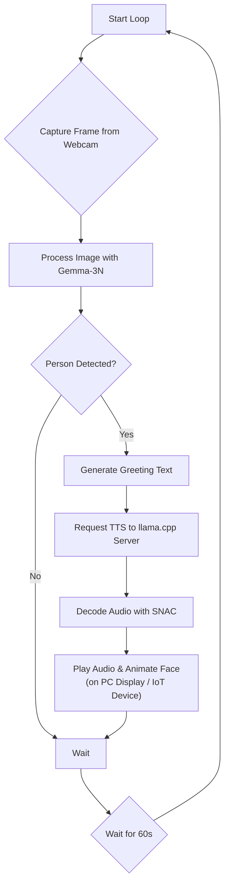
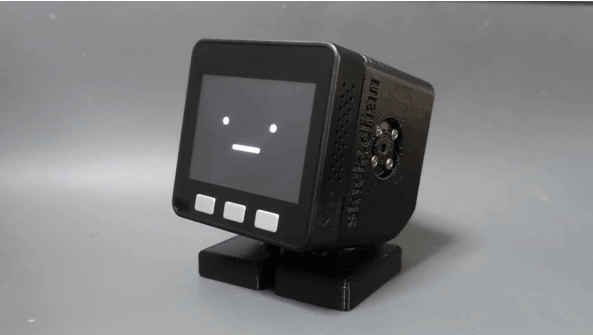

# StandbyMeAI

[](https://www.kaggle.com/competitions/google-gemma-3n-hackathon/overview)

StandbyMeAI is an interactive AI assistant project developed for a Kaggle competition. It leverages multimodal models to understand visual information from a webcam, generate contextual responses, and communicate using Text-to-Speech (TTS) with a symbolic face animation.

## System Architecture

The application operates in a continuous loop with the following workflow:



## Features

*   **Visual Recognition**: Identifies a specific person from a webcam feed using `Gemma-3N`.
*   **Contextual Greeting**: Generates personalized greetings upon successful recognition.
*   **High-Quality TTS**: Converts text into natural-sounding speech using GGUF models served by `llama.cpp`.
*   **Multilingual Ready**: Easily switch between Japanese and English TTS by changing the model and prompt.
*   **Animated Interface**: Displays a simple, symbolic face that animates while scanning and speaking.
*   **Hardware Extensibility**: Designed from the ground up to be deployed on custom IoT hardware, enabling a standalone physical presence.

## Hardware Requirements

*   PC with 32GB or more of main memory. (GPU recommended for `llama.cpp` server but not required)
*   Web camera.

## Directory Structure
```
.
├── .gitignore
├── README.md
├── environment.yml
└── src/
    ├── __init__.py
    └── main.py
```
*(It is recommended to split the classes in `main.py` into separate files for better maintainability)*

## Setup

### Step 1: Clone Repository and Create Conda Environment

1.  **Clone this repository:**
    ```bash
    git clone https://github.com/your-username/StandbyMeAI.git
    cd StandbyMeAI
    ```

2.  **Create and activate the Conda environment:**
    ```bash
    conda env create -f environment.yml
    conda activate StandbyMeAI
    ```

### Step 2: Set Up the TTS Server with `llama.cpp`

This application requires a separate server process running `llama.cpp` to handle Text-to-Speech generation.

1.  **Clone and build `llama.cpp`:**
    Follow the official instructions to build `llama.cpp`. A GPU-enabled build (e.g., via CUDA) is highly recommended for performance.
    ```bash
    git clone https://github.com/ggerganov/llama.cpp.git
    cd llama.cpp
    make # Or follow specific instructions for your system (e.g., with CUDA, Metal)
    cd ..
    ```

2.  **Download the TTS Model (GGUF):**
    *   **For Japanese:** [webbigdata/VoiceCore_gguf](https://huggingface.co/webbigdata/VoiceCore_gguf)
    *   **For English:** [dahara1/orpheus-3b-0.1-ft_gguf](https://huggingface.co/dahara1/orpheus-3b-0.1-ft_gguf)

3.  **Run the `llama.cpp` server:**
    Open a new terminal and run the server with the appropriate model.
    
    **Example command for Japanese Model:**
    ```bash
     path/to/your/llama-server -m path/to/VoiceCore-Q4_K-f16.gguf --prio 3 -c 2048 -e -n -2 --port 8081 --host 0.0.0.0 --no-webui -v --cont-batching
    ```
    **Example command for English model:**
    ```bash
    path/to/your/llama-server -m path/to/orpheus-3b-Q4_K-f16.gguf --prio 3 -c 2048 -e -n -2 --port 8081 --host 0.0.0.0 --no-webui -v --cont-batching
    ```
    *   Replace paths with the actual paths to your `llama-server` executable and `.gguf` model file.
    *   To use a GPU, add flags like `-ngl 35`.
    *   **Keep this terminal window open.**

### Step 3: Configure for English (Optional)
To switch to English TTS:
1.  Run the `llama-server` with the Orpheus model.
2.  In the Python script, modify the prompt (in `image_processing.py`) and the speaker name (e.g., `matsukaze_male[neutral]` to `tara` in `tts_system.py`).

## Usage

Once the environment is active and the server is running:

```bash
cd src
python main.py
```

Press `Ctrl+C` in the terminal to stop the application gracefully.

## Future Features & Vision

*   **Physical Embodiment on IoT Devices**:
    Currently, the assistant's face is rendered on the PC monitor for easy verification by the contest judges. However, the ultimate vision for this project is to run on low-cost, standalone IoT hardware. This would give the assistant a true physical presence. For example, it could be embodied in a device like **[Stack-chan](https://github.com/stack-chan/stack-chan)**, as shown below. This transition would free up the PC display and, more importantly, enable the use of various sensors (motion, light, temperature, etc.) to create a much richer and more proactive user experience.

    

*   **Full Dialogue System**: Integration of high-performance Speech-to-Text (e.g., `whisper.cpp`) and an LLM for conversational abilities.
*   **Dynamic Prompting**: More sophisticated logic for generating varied and context-aware responses.